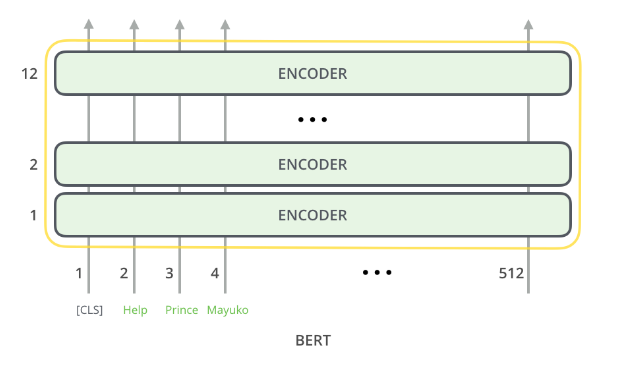

# CSIS-4260 Project 
Zito Relova 300306471

## Overview

A lot of people rely on images online to help them learn and understand new concepts. Images can sometimes convey information that words cannot. Despite this, a lot of the largest websites lack visual content (eg. images) as well as metadata (eg. captions) to pair with their images. A majority of Wikipedia articles, for example, don't have any written context connected to their images. These captions help increase accessibility and also improve search for different images. In this project, we aim to build a model that accepts an image as an input and retrieves the caption that most closely matches it from our dataset.

Sample image caption pair from the dataset

## Dataset

The dataset used for the project can be found at https://analytics.wikimedia.org/published/datasets/one-off/caption_competition/training/joined/.
The entire dataset has a total size of around 275GB. It is split into 400 different json.gz files, each one holding around 670MB of data. 

Each entry in the dataset is a JSON object consisting of the following features:
 - **image_url** - the URL to the original image file
 - **wit_features** - an array containing information about the entry including:
    - **language** - the language of the image caption
    - **page_url** - the URL of the Wikipedia page where the image can be seen
    - **image_url** - the URL to the original image file
    - **page_title** - the title of the page containing the image
    - **section_title** - the title of the section containing the image
    - **hierarchical_section_title** - a hierarchical representation of the section containing the image
    - **caption_reference_description** - the caption for the image
    - **mime_type** - the MIME type of the image
    - **original_height** - the original height of the image
    - **original_width** - the original width of the image
    - **is_main_image** - whether the image is the main image of the page
    - **attribution_passes_lang_id** - whether the attribution text of the image passes the language id
    - **page_changed_recently** - whether the page has been changed recently
    - **context_page_description** - the description for the context page
 - **b64_bytes** - the base64 encoding of the original image file
 - **metadata_url** - the URL to the commons page of the image
 - **embedding** - a comma separated list of 2048 float values representing the ResNet embedding of the image

An sample entry for the [Wikipedia page of Half Dome](https://en.wikipedia.org/wiki/Half_Dome) is shown below.

<a href="https://en.wikipedia.org/wiki/Half_Dome">Source</a>

Given a Wikipedia page like this, we are interested in extracting key pieces of information like the page title, page description, the images in the page, and also their reference descriptions. We can see these pieces of information highlighted below.

<a href="https://en.wikipedia.org/wiki/Half_Dome">Source</a>

## Model Architecture

The problem we face is that of Semantic Image Text Similarity (SITS). This differs from a traditional image captioning problem where a caption is created by a generative model given an image as an input. Instead, we must retrieve an existing caption from our dataset. But how do we match images to captions? 

We create a model with two different encoders, specifically for processing images and text simultaneously. The aim of this model is to create a common embedding space between images and text such that measures of similarity can be used to exploit relationships between the resulting embeddings. Once the dataset is processed and the embedding space is created, we can do a nearest neighbor search given an image to determine which text embedding it is closest to.

The network for creating the embedding space is composed of a dual encoder architecture. One encoder is used for image encoding while another is used for text encoding. The outputs of these encoders are 768 dimensional vectors that are passed through a constrastive loss function. 

Using the output of the loss, we can predict whether the caption matches the image or not. This is represented by the ground truth labels we define in our dataset (1 for a positive match and -1 for a negative match).

Simplified model architecture

### EfficientNet-B0

The image encoder being used is EfficientNet-B0. EfficientNet attempts to solve the problem of model scaling in CNNs. There are three main methods currently being used to scale up a CNN. These are width scaling (increasing convolution sizes, adding more feature channels, etc.), depth scaling (increasing number of hidden layers), and resolution scaling (increasing image resolution). There is no scientific way to balance each of these methods and all scaling solutions thus far have used arbitrary combinations of each of them.

 
 

<a href="https://arxiv.org/abs/1905.11946v5">Source</a>

EfficientNet proposes a compound scaling method to uniformly scale network width, depth, and resolution in a principled way. The mathematical representation of the method is shown below.

<a href="https://arxiv.org/abs/1905.11946v5">Source</a>

The alpha, beta, and gamma parameters to control depth, width, and resolution respectively, are constants that are determined via grid search. The coefficient phi is user-defined depending on how many more resources are available to scale the model. The baseline network presented in the initial EfficientNet paper (code named EfficientNet-B0) is illustrated below.

<a href="https://ai.googleblog.com/2019/05/efficientnet-improving-accuracy-and.html">Source</a>

In our model, EfficientNet-B0 is used as an encoder to map an image to a vector on our embedding space. The output of this encoder is a 768 dimensional vector existing in the embedding space through which we can calculate distance metrics.
 
 

### BERT

The text encoder being used is BERT base. An illustration of the encoder is shown below.

<a href="https://jalammar.github.io/illustrated-bert/">Source</a>

BERT can be seen as a stack of encoding layers (called Transformer Blocks). The specific implementation we use in this model has 12 encoding layers. Each encoder is composed of a self-attention layer follow by a feed forward network.

<a href="https://jalammar.github.io/illustrated-transformer/">Source</a>

The output for BERT base is a 768 dimensional vector representing a piece of text.
In our model, BERT is used as an encoder to map a string to a vector on our embedding space. The output of this encoder is a 768 dimensional vector existing in the embedding space through which we can calculate distance metrics.

## Training

We trained our model on a single p3.xlarge instance with a Tesla V100 GPU and 16GB of memory. Due to size of the entire dataset, we limited our training to a subset of three json.gz files totaling around 1.5GB. We trained for 5 epochs using a cosine embedding loss and a layer-wise adaptive moments (LAMB) optimizer.

Training run

### Loss

The loss is a cosine embedding loss for minimizing the distance between two related vectors. Measuring cosine similarity differs from Euclidean distance in that cosine similarities do not take vector magnitudes into account. Instead, when looking at

Cosine embedding loss

### Optimizer

The optimizer used to update model weights is the Layer-wise Adaptive Moments optimizer for Batch training (LAMB). To understand LAMB, we will look at traditional optimizers like SGD and the disadvantages they have when training on large batch sizes. With SGD, all model weights are updated using a learning rate &lambda; through a weight update formula that looks like wi + 1 = wi - &lambda;i * &Delta;L(wi). When &lambda; becomes too large, the update can become larger than the norm of the current weight, causing the training process to diverge.

Based on an analysis of weight to gradient norm ratios for large batch sizes, it is observed that these ratios can become very small resulting in training divergence. This divergence has a smaller effect on small batch sizes but necessitates different learning rates for each layer when training on large batch sizes.

<a href="https://openreview.net/forum?id=Syx4wnEtvH">Weight to gradient norm ratios across layers</a>

The Layer-wise Adaptive Rate Scaling (LARS) optimizer extends SGD by determining a learning rate per layer. This is done by normalizing the gradients by L2 gradient norm and scaling normalized gradients by the L2 weight norm, effectively decoupling the magnitude of the update from the magnitude of the gradient. The weight to gradient norm ratio for each layer is called the trust ratio in the original paper.

LAMB extends LARS by making a few changes. First, the denominator of the trust ratio is changed from |&Delta;L| + &Beta; |w| to 
|&Delta;L + &Beta; w|. Next, instead of using the SGD update rule discussed above, the Adam update rule is used instead where a moving average across gradients is computed. Lastly, the trust ratio is clipped to a maximum value of 10. The full pseudocode for the optimizer is shown below.

Pseudocode for LAMB optimizer

## Results
TODO

## References
- Jain, Aashi, et al. “MURAL: Multimodal, Multitask Retrieval Across Languages.” ArXiv:2109 05125 [Cs], Sept. 2021. arXiv.org, http://arxiv.org/abs/2109.05125.

- Tan, Mingxing, and Quoc V. Le. “EfficientNet: Rethinking Model Scaling for Convolutional Neural Networks.” ArXiv:1905.11946 [Cs, Stat], Sept. 2020. arXiv.org, http://arxiv.org/abs/1905.11946.

- Tan, Mingxing, and Quoc V. Le. “EfficientNetV2: Smaller Models and Faster Training.” ArXiv:2104.00298 [Cs], June 2021. arXiv.org, http://arxiv.org/abs/2104.00298.

- “EfficientNet: Improving Accuracy and Efficiency through AutoML and Model Scaling.” Google AI Blog, http://ai.googleblog.com/2019/05/efficientnet-improving-accuracy-and.html. Accessed 16 Nov. 2021.

- Vaswani, Ashish, et al. “Attention Is All You Need.” ArXiv:1706.03762 [Cs], Dec. 2017. arXiv.org, http://arxiv.org/abs/1706.03762.

- Srinivasan, Krishna, et al. “WIT: Wikipedia-Based Image Text Dataset for Multimodal Multilingual Machine Learning.” ArXiv:2103.01913 [Cs], Mar. 2021. arXiv.org, http://arxiv.org/abs/2103.01913.

- Ruiqi Guo, Philip Sun, Erik Lindgren, Quan Geng, David Simcha, Felix Chern, and Sanjiv Kumar. 2020. Accelerating large-scale inference with anisotropic vector quantization. In Proceedings of the 37th International Conference on Machine Learning, ICML 2020, 13-18 July 2020, Virtual Event, volume 119 of Proceedings of Machine Learning Research, pages 3887–3896. PMLR

- Parekh, Zarana, et al. “Crisscrossed Captions: Extended Intramodal and Intermodal Semantic Similarity Judgments for MS-COCO.” Proceedings of the 16th Conference of the European Chapter of the Association for Computational Linguistics: Main Volume, Association for Computational Linguistics, 2021, pp. 2855–70. ACLWeb, https://aclanthology.org/2021.eacl-main.249.

- Devlin, Jacob, et al. “BERT: Pre-Training of Deep Bidirectional Transformers for Language Understanding.” ArXiv:1810.04805 [Cs], May 2019. arXiv.org, http://arxiv.org/abs/1810.04805.

- You, Yang, et al. Large Batch Optimization for Deep Learning: Training BERT in 76 Minutes. 2019. openreview.net, https://openreview.net/forum?id=Syx4wnEtvH.

- Diao, Haiwen, et al. “Similarity Reasoning and Filtration for Image-Text Matching.” ArXiv:2101.01368 [Cs], Jan. 2021. arXiv.org, http://arxiv.org/abs/2101.01368.

- Sanh, Victor, et al. “DistilBERT, a Distilled Version of BERT: Smaller, Faster, Cheaper and Lighter.” ArXiv:1910.01108 [Cs], Feb. 2020. arXiv.org, http://arxiv.org/abs/1910.01108.

- Jia, Chao, et al. “Scaling Up Visual and Vision-Language Representation Learning With Noisy Text Supervision.” ArXiv:2102.05918 [Cs], June 2021. arXiv.org, http://arxiv.org/abs/2102.05918.

- Zagoruyko, Sergey, and Nikos Komodakis. “Wide Residual Networks.” ArXiv:1605.07146 [Cs], June 2017. arXiv.org, http://arxiv.org/abs/1605.07146.

- Kingma, Diederik P., and Jimmy Ba. “Adam: A Method for Stochastic Optimization.” ArXiv:1412.6980 [Cs], Jan. 2017. arXiv.org, http://arxiv.org/abs/1412.6980.

- Bay, Alessandro, and Biswa Sengupta. “StackSeq2Seq: Dual Encoder Seq2Seq Recurrent Networks.” ArXiv:1710.04211 [Cs, Stat], Jan. 2018. arXiv.org, http://arxiv.org/abs/1710.04211.

- Bahdanau, Dzmitry, et al. “Neural Machine Translation by Jointly Learning to Align and Translate.” ArXiv:1409.0473 [Cs, Stat], May 2016. arXiv.org, http://arxiv.org/abs/1409.0473.

- A. Karpathy and L. Fei-Fei, "Deep visual-semantic alignments for generating image descriptions," 2015 IEEE Conference on Computer Vision and Pattern Recognition (CVPR), 2015, pp. 3128-3137, doi: 10.1109/CVPR.2015.7298932.

- Sandler, Mark, et al. “MobileNetV2: Inverted Residuals and Linear Bottlenecks.” ArXiv:1801.04381 [Cs], Mar. 2019. arXiv.org, http://arxiv.org/abs/1801.04381.

- Howard, Andrew, et al. “Searching for MobileNetV3.” ArXiv:1905.02244 [Cs], Nov. 2019. arXiv.org, http://arxiv.org/abs/1905.02244.

- Li, Kunpeng, et al. “Visual Semantic Reasoning for Image-Text Matching.” ArXiv:1909.02701 [Cs], Sept. 2019. arXiv.org, http://arxiv.org/abs/1909.02701.

- Lee, Kuang-Huei, et al. “Stacked Cross Attention for Image-Text Matching.” ArXiv:1803.08024 [Cs], July 2018. arXiv.org, http://arxiv.org/abs/1803.08024.

